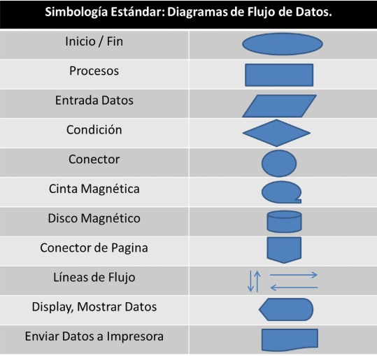
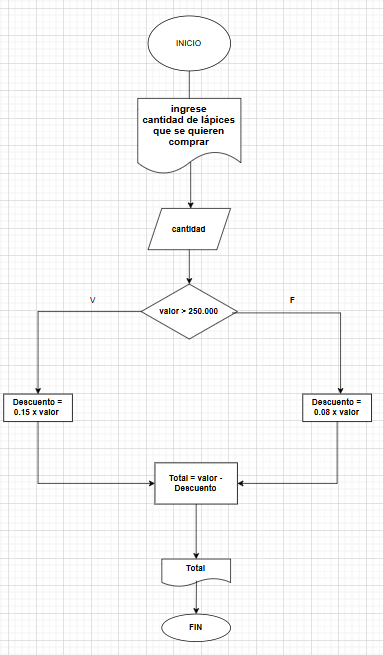
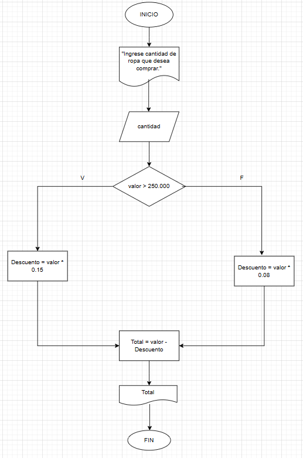
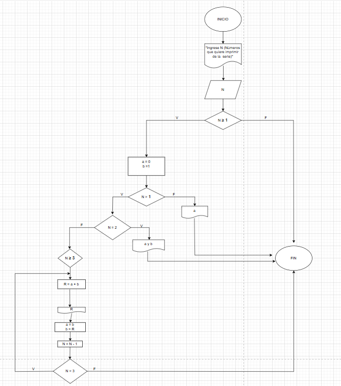

# ACTIVIDAD 3

## Ejercicio 1

En un diagrama de flujo para representar un código de programación se utilizan distintos símbolos con significados específicos. Por ejemplo, el óvalo se usa para indicar el inicio y el fin del programa, el rectángulo representa procesos o acciones como cálculos y asignaciones de variables, y el rombo se emplea para decisiones, como una condición que determina qué camino seguir. También se usan flechas para indicar el flujo del programa y paralelogramos para representar la entrada y salida de datos. Estos símbolos ayudan a visualizar mejor la lógica del código antes de escribirlo.  

## Ejercicio 2 

Inicio  
Solicitar el ID del empleado  
Escribir "Ingrese el ID del empleado:"  
Leer idEmpleado  
 
Solicitar los seis sueldos del semestre  
Escribir "Ingrese los seis primeros sueldos del año:"   
Leer sueldo1, sueldo2, sueldo3, sueldo4, sueldo5, sueldo6   
 
Calcular el ingreso total semestral    
ingresoTotal = sueldo1 + sueldo2 + sueldo3 + sueldo4 + sueldo5 + sueldo6  
 
Calcular el promedio mensual  
promedioMensual = ingresoTotal / 6  
 
Imprimir los resultados  
 Escribir "ID del empleado: ", idEmpleado  
Escribir "Ingreso total semestral: ", ingresoTotal  
Escribir "Promedio mensual: ", promedioMensual  
Fin  

### Ejercicios

1. Realice un algoritmo para determinar cuánto se debe pagar por equis cantidad de lápices considerando que si son 1000 o más el costo es de $85 cada uno; de lo contrario, el precio es de $90. Represéntelo con el pseudocódigo y el diagrama de flujo.

R// INICIO   

Escribir “ingrese cantidad de lápices que se quieren comprar”   

Leer cantidad   

Si cantidad ≥ 1000   

Costo = 85   

Si cantidad < 1000   

Costo = 90   

Fin si    

Total = Costo × cantidad    

Imprimir Total    
  
FIN   

2. Un almacén de ropa tiene una promoción: por compras superiores a $250 000 se les aplicará un descuento de 15%, de caso contrario, sólo se aplicará un 8% de descuento. Realice un algoritmo para determinar el precio final que debe pagar una persona por comprar en dicho almacén y de cuánto es el descuento que obtendrá. Represéntelo mediante el pseudocódigo y el diagrama de flujo.  

R//Inicio    

Escribir “Ingrese valor de compra”   

Leer valor    

Si valor > 250.000   

Descuento = 0.15 ×valor   

Si no    

Descuento = 0.08 × valor    

Fin si    

Total = valor – Descuento   

Imprimir total    

FIN    

3. El director de una escuela está organizando un viaje de estudios, y requiere determinar cuánto debe cobrar a cada alumno y cuánto debe pagar a la compañía de viajes por el servicio. La forma de cobrar es la siguiente: si son 100 alumnos o más, el costo por cada alumno es de $65; de 50 a 99 alumnos, el costo es de $70, de 30 a 49, de $95, y si son menos de 30, el costo de la renta del autobús es de $4000, sin importar el número de alumnos.  

R//Inicio    

Escribir “Ingrese el número de alumnos”    
Leer alumnos    

Si alumnos >= 100    
CostoPorAlumno = 65    
Si no    
Si alumnos >= 50    
CostoPorAlumno = 70    
Si no    
Si alumnos >= 30    
CostoPorAlumno = 95    
Si no    
CostoTotal = 4000    
CostoPorAlumno = CostoTotal / alumnos    
Fin si    
Fin si    
Fin si    

Si alumnos >= 30    
CostoTotal = alumnos * CostoPorAlumno    
Fin si    

Escribir “El costo por alumno es:”, CostoPorAlumno    
Escribir “El costo total del viaje es:”, CostoTotal    

Fin    

4. Se requiere un algoritmo para obtener la estatura promedio de un grupo de personas, cuyo número de miembros se desconoce, el ciclo debe efectuarse siempre y cuando se tenga una estatura registrada. Realice el diagrama de flujo, el pseudocódigo y el diagrama N/S para representarlo, utilizando el ciclo apropiado.  
 
Como se puede ver, para resolver este problema no se puede utilizar el ciclo Desde, ya que no se tiene el número de personas exacto, que es lo que en un momento determinaría el número de veces que el proceso que se encuentra dentro del ciclo se ejecute, para este caso es necesario contar al menos con la estatura de una persona (para que tenga caso realizar el proceso del ciclo). Por otro lado, si se utiliza el ciclo Repite, se ejecutará por lo menos una vez y hasta que se le proporcione una estatura menor o igual a cero, por tal motivo no es muy conveniente utilizarlo, ya que se debe tener al menos una estatura para realizar lo que se pretende con el algoritmo.  

R// INICIO  
suma = 0  
num_personas = 0   
estatura = 1  
Escribir "ingrese estaturas"  
mientras estatura > 0   
 
leer estatura    
suma = suma + estatura   
num_personas = num_personas + 1  
 
Fin mientras   
si suma > 0  
promedio = suma / num_personas  con num_personas > 0  
escribir promedio  
FIN    

5. Diagrama de flujo codigo que escriba Nnumeros de la serie de Fibonacci.  

R//    

## Parte final 

### Parte 1: Identificar Algoritmos

1. Una página web. No es un algoritmo porque no sigue una serie de pasos para resolver un problema, solo muestra información.  

2. Una receta para hacer un pastel, donde se indican ingredientes y pasos a seguir. Sí es un algoritmo porque tiene instrucciones ordenadas que llevan a un resultado, en este caso, el pastel.   

3. "Piensa en un número y multiplícalo por otro". No es un algoritmo porque no tiene un procedimiento claro ni pasos bien definidos.  

4. Un manual de instrucciones para armar un mueble, con pasos detallados y un orden claro. Sí es un algoritmo porque sigue una secuencia de pasos específicos para llegar a un resultado, que es armar el mueble.  

5. Una lista de compras organizada en orden alfabético. No es un algoritmo porque solo es una lista de elementos sin un conjunto de instrucciones que seguir.  

### Parte 2: Variables y Constantes

1. El valor de la gravedad en la Tierra, 9.8 m/s². → Constante, porque su valor no cambia.  

2. La edad de una persona calculada en base al año actual y su año de nacimiento. → Variable, porque cambia cada año.  

3. La cantidad de dinero en una cuenta bancaria. → Variable, porque puede aumentar o disminuir con depósitos y retiros.  

4. La velocidad de la luz en el vacío, 299,792,458 m/s. → Constante, porque su valor siempre es el mismo.  

5. El radio de un círculo. → Variable, porque depende del tamaño del círculo y puede cambiar.  

### Parte 3: Características de los Algoritmos

1. Para elegir la ruta más corta entre varias ciudades, el algoritmo examina rutas candidatas, deteniéndose cuando los cambios en la distancia parecen lo suficientemente pequeños. No es un algoritmo porque no tiene una condición de finalización clara y se basa en un criterio subjetivo.    

2. Suma los números ingresados y muestra el resultado. Sí es un algoritmo porque sigue una serie de pasos definidos: recibir los números, sumarlos y mostrar el resultado.  

3. Un conjunto de pasos para calcular el área de un rectángulo dado su base y altura. Sí es un algoritmo porque tiene instrucciones claras: tomar la base y la altura, multiplicarlas y mostrar el resultado.  

4. El algoritmo cuenta el número de votos obtenidos por cada uno de los candidatos de una elección para presidente. Empieza solicitando el nombre del candidato y finaliza cuando se ingresa el valor -1. Sí es un algoritmo porque tiene un inicio, un proceso definido y una condición clara para terminar.  

### Parte 4: Comprensión de Herramientas

1. El pseudocódigo utiliza símbolos estándar para representar las operaciones lógicas. Falso, porque el pseudocódigo se escribe con palabras y no usa símbolos gráficos.

2. Los diagramas de flujo son una representación gráfica de un algoritmo. Verdadero, porque usan símbolos y flechas para mostrar visualmente el flujo de un algoritmo.

3. El pseudocódigo debe estar escrito en un lenguaje de programación específico. Falso, porque el pseudocódigo no sigue un lenguaje de programación en particular, solo representa los pasos de un algoritmo de forma clara.

4. Un diagrama de flujo siempre debe tener un inicio y un fin claramente definidos. Verdadero, porque todo algoritmo necesita un punto de inicio y un punto de terminación para que su ejecución sea clara.

### Parte 5: Estructuras de Control

Las estructuras de control sirven para organizar y definir el flujo de un algoritmo, permitiendo tomar decisiones, repetir acciones o ejecutar instrucciones en un orden específico según ciertas condiciones.

**Ejemplo de la vida diaria:**    
Si es de noche, enciendo la luz; si es de día, no la enciendo.

**Ejemplo con cálculos matemáticos:**    
Si un estudiante obtiene una calificación mayor o igual a 3.0, aprueba la materia; si obtiene menos de 3.0, reprueba.