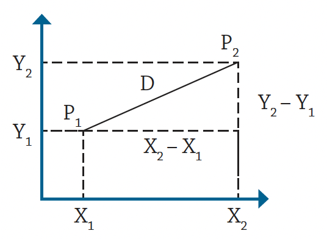
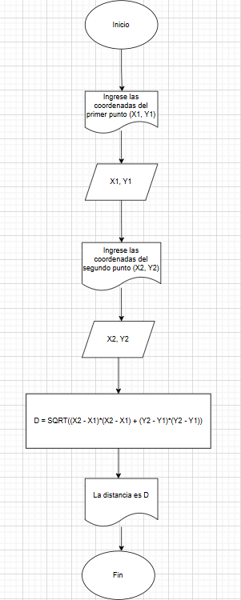

# RETOS

1. **Se requiere obtener la distancia entre dos puntos en el plano cartesiano,
tal y como se muestra en la figura 1. Realice un diagrama de flujo y pseudocódigo
que representen el algoritmo para obtener la distancia entre
esos puntos.**

**R//**   
Inicio  
Escribir "Ingrese las coordenadas del primer punto (X1, Y1)"  
Leer X1, Y1    
Escribir "Ingrese las coordenadas del segundo punto (X2, Y2)"  
Leer X2, Y2  
D = SQRT ((X1-X2)*(X1-X2)+(Y1-Y2)*(Y1-Y2))  
Escribir "La distancia entre los dos puntos es: ", D  
Fin  

  

2. **Una modista, para realizar sus prendas de vestir, encarga las telas al extranjero.
Para cada pedido, tiene que proporcionar las medidas de la tela
en pulgadas, pero ella generalmente las tiene en metros. Realice un algoritmo
para ayudar a resolver el problema, determinando cuántas pulgadas
debe pedir con base en los metros que requiere. Represéntelo mediante un
diagrama de flujo y pseudocódigo (1 pulgada = 0.0254 m).**

**R//**  
Inicio     
Escribir "ingrese la cantidad de tela en metros"  
Leer metros   
Pulgadas = metros/0.0254  
Escribir "Son", Pulgadas, "pulgadas de tela."  
Fin  

  

3. **Se requiere determinar la hipotenusa de un triángulo rectángulo. ¿Cómo sería el diagrama de flujo y el pseudocódigo que representen el algoritmo para obtenerla? 
Recuerde que por Pitágoras se tiene que: $C^2 = A^2 + B^2$.**

**R//**  
Inicio  
Escribir "Ingrese la longitud del cateto A:"  
Leer A  
Escribir "Ingrese la longitud del cateto B:"  
Leer B  
C = SQRT((A*A) + (B*B) )  
Escribir "La hipotenusa del triángulo es: ", C  
Fin  

  

4. **Se requiere determinar la edad actual de una persona basándose en su fecha de nacimiento. Además, es necesario establecer si la persona ya ha cumplido años en el año en curso, si aún no lo ha hecho, o si hoy es su cumpleaños, para celebrarlo. La fecha de nacimiento y la fecha actual estarán representadas mediante tres variables: día, mes y año.**
    
    **Pasos a seguir:**
    
    - Diseñe un algoritmo que permita calcular la edad de la persona.
    - Determine si la persona ya celebró su cumpleaños este año o si aún no lo ha hecho.
    - Verifique si la fecha actual corresponde al día de su cumpleaños. De ser así, imprima el mensaje “Feliz Cumpleaños”.
    - Represente la solución utilizando pseudocódigo claro y estructurado.

**R//**  
Inicio  
Escribir "Ingrese su fecha de nacimiento (día, mes, año):"  
Leer dia_nacimiento, mes_nacimiento, año_nacimiento  

Escribir "Ingrese la fecha actual (día, mes, año):"  
Leer dia_actual, mes_actual, año_actual  

edad = año_actual - año_nacimiento  

Si (mes_actual > mes_nacimiento) o (mes_actual = mes_nacimiento y dia_actual >= dia_nacimiento) Entonces  
ya_cumplio = Verdadero  
Sino  
ya_cumplio = Falso  
FinSi  

Si no ya_cumplio Entonces  
edad = edad - 1  
FinSi  

Si (dia_actual = dia_nacimiento) y (mes_actual = mes_nacimiento) Entonces  
Escribir "¡Feliz Cumpleaños!"  
FinSi  
Escribir "La edad actual es: ", edad  

Si ya_cumplio Entonces  
Escribir "Ya celebraste tu cumpleaños este año."  
Sino  
Escribir "Aún no has celebrado tu cumpleaños este año."       
FinSi  
Fin

5. **Realice un algoritmo que permita determinar el sueldo semanal de un trabajador con base en las horas trabajadas y el pago por hora, considerando que a partir de la hora número 41 y hasta la 45, cada hora se le paga el doble, de la hora 46 a la 50, el triple, y que trabajar
más de 50 horas no está permitido. Represente el algoritmo mediante pseudocódigo.**

**R//**    
Inicio  

Escribir "Ingrese el número de horas trabajadas en la semana:"  
Leer horas_trabajadas  

Escribir "Ingrese el pago por hora:"  
Leer pago_hora  

Si horas_trabajadas > 50 Entonces  
Escribir "No es permitido trabajar más de 50 horas."  
Sino  

Si horas_trabajadas <= 40 Entonces  
sueldo = horas_trabajadas * pago_hora  
Sino  

Si horas_trabajadas <= 45 Entonces  
sueldo = (40 * pago_hora) + ((horas_trabajadas - 40) * pago_hora * 2)  
Sino  
sueldo = (40 * pago_hora) + (5 * pago_hora * 2) + ((horas_trabajadas - 45) * pago_hora * 3)  
FinSi  

FinSi  

Escribir "El sueldo semanal es: ", sueldo  

FinSi  

Fin  

6. **Se requiere un algoritmo para determinar, de N cantidades, cuántas son cero, cuántas son menores a cero, y cuántas son mayores a cero. Realice el pseudocódigo para representarlo, utilizando el ciclo apropiado.**  

**R//**  
Inicio  

Escribir "Ingrese la cantidad de números a evaluar:"  
Leer N  

ceros = 0  
menores = 0  
mayores = 0  

Para i = 1 Hasta N Hacer  
Escribir "Ingrese un número:"  
Leer numero  

Si numero = 0 Entonces  
ceros = ceros + 1  
Sino  
Si numero < 0 Entonces  
menores = menores + 1  
Sino  
mayores = mayores + 1  
FinSi  
FinSi  

FinPara  

Escribir "Cantidad de ceros:", ceros  
Escribir "Cantidad de números menores a cero:", menores  
Escribir "Cantidad de números mayores a cero:", mayores  

Fin  

7. **Se requiere un algoritmo para determinar cuánto ahorrará en pesos una persona diariamente, y en un año, si ahorra 3¢ el primero de enero, 9¢ el dos de enero, 27¢ el 3 de enero y así sucesivamente todo el año. Represente la solución mediante pseudocódigo.**  

**R//**  
Inicio   
 
ahorro_diario = 0.03   
ahorro_total = 0    

Para dia = 1 Hasta 365 Hacer   
Escribir "Día ", dia, ": ahorro = ", ahorro_diario, " pesos"   
ahorro_total = ahorro_total + ahorro_diario   
ahorro_diario = ahorro_diario * 3   
FinPara   

Escribir "El ahorro total en un año es: ", ahorro_total, " pesos"   

Fin   

8. **Realice el algoritmo para determinar cuánto pagará una persona que adquiere N artículos, los cuales están de promoción. Considere que si su precio es mayor o igual a $200 se le aplica un descuento de 15%, y si su precio es mayor a $100, pero menor a $200, el descuento es de
12%; de lo contrario, solo se le aplica 10%. Se debe saber cuál es el costo y el descuento que tendrá cada uno de los artículos y finalmente cuánto se pagará por todos los artículos obtenidos. Represente la solución mediante pseudocódigo.**  

**R//**  
Inicio  

Escribir "Ingrese la cantidad de artículos a comprar:"  
Leer N  

total_a_pagar = 0  

Para i = 1 Hasta N Hacer  
Escribir "Ingrese el precio del artículo ", i, ":"  
Leer precio  

Si precio ≥ 200 Entonces  
descuento = precio * 0.15  
Sino  
Si precio > 100 Entonces  
descuento = precio * 0.12  
Sino  
descuento = precio * 0.10  
FinSi  
FinSi  

precio_final = precio - descuento  

Escribir "Artículo ", i, ": Precio = ", precio, " Descuento = ", descuento, " Precio final = ", precio_final  

total_a_pagar = total_a_pagar + precio_final  
FinPara  

Escribir "El total a pagar por todos los artículos es: ", total_a_pagar  

Fin  

9. **Realice un algoritmo y represéntelo mediante pseudocódigo para obtener una función exponencial, la cual está dada por:**
    
    $𝑒^𝑥 = 1+\frac x {1!} + \frac {x^2}{2!}+ \frac {x^3}{3!}+ …$**

**R//**
Inicio  

Escribir "Ingrese el valor de x:"  
Leer x  

Escribir "Ingrese la cantidad de términos a calcular:"  
Leer n  

resultado = 1  
termino = 1  

Para i = 1 Hasta n Hacer  
termino = termino * (x / i)  
resultado = resultado + termino  
FinPara  

Escribir "El valor aproximado de e^", x, " es: ", resultado  

Fin  

10. **Realice un algoritmo para obtener el seno de un ángulo y represéntelo mediante pseudocódigo. Utilice la siguiente ecuación:**  
$Sen x = x - \frac{x^3}{3!} + \frac{x^5}{5!} - \frac{x^7}{7!} + ...$  

**R//**  
Inicio  

Escribir "Ingrese el valor del ángulo en grados:"  
Leer grados  

x = grados * (π / 180)  

Escribir "Ingrese la cantidad de términos a calcular:"  
Leer n  

resultado = x  
termino = x  
signo = -1  

Para i = 1 Hasta n Hacer  
exponente = 2 * i + 1  
termino = termino * (x * x) / (exponente * (exponente - 1))  
resultado = resultado + (signo * termino)  
signo = signo * -1  
FinPara  

Escribir "El valor aproximado de Sen(", grados, "°) es: ", resultado  

Fin  
